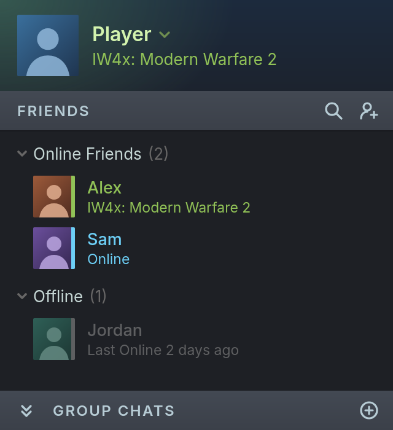

# companion - Steam friends presence for IW4x.

`companion` is a Steam client module that lets IW4x choose what your Steam
friends see as the game you are playing, the line under your name in their
friends list. The game sets this text, for example,
`IW4x: Modern Warfare 2`, and can change it at any time while it runs.
Without the companion, your friends see the Steam app that IW4x runs as
(Call of Duty: Modern Warfare 2 or Spacewar) or, if you start the game from
a non-Steam shortcut, the name of the shortcut. The companion is for IW4x
players on Windows and on Linux, where it works with the native Linux Steam
client running the game under Proton.

<p>
  
</p>

The companion runs inside the Steam client and intercepts the `GamesPlayed`
message, with which the client reports the running games to Steam. In each
entry that refers to a running IW4x process, it sets the text that friends
see to the one that the game provides. It also sets the Steam app to one
that the account owns, Call of Duty: Modern Warfare 2 or, if the account
does not own it, Spacewar, which every account owns. Every other message is
sent unchanged and no Steam or game files are modified.

For details on how the companion works, including the protocol between the
game and the companion, see the companion manual
(`libcompanion/doc/manual.cli`).

## Development

This section contains setup instructions and other details that are more
appropriate for development. If you want to use `libcompanion` in your
`build2`-based project, then see the package
[`README.md`](libcompanion/README.md) file.

The companion requires the `build2` toolchain 0.18.0 or later and GCC 16 or
later. Building the Linux module also requires the 32-bit glibc and
libstdc++ development files (`glibc-devel.i686` and `libstdc++-devel.i686`
on Fedora, for example). Building the Windows module requires MinGW-w64 GCC
and running its tests on Linux requires [Wine](https://www.winehq.org/).

The development build generates the man page and the manual with the
[CLI](https://codesynthesis.com/projects/cli/) compiler, which `bdep` builds
from `cppget.org` as a build-time dependency in a configuration of the host
type. For this reason the project is first initialized without any
configurations and only initialized in the build configurations once the
host configuration exists.

The development setup for `companion` uses the standard `bdep`-based
workflow with a build configuration for each target. For example, on Linux:

```sh
git clone https://github.com/iw4x/companion.git
cd companion

bdep init --empty
bdep config create @host --type host --no-default ../companion-host \
  cc config.config.load=~host

bdep init -C ../companion-gcc @gcc cc \
  config.cxx=g++

bdep init -C ../companion-gcc32 @gcc32 cc \
  config.cxx='g++ -m32'                   \
  config.cxx.target=i686-linux-gnu        \
  config.c='gcc -m32'                     \
  config.c.target=i686-linux-gnu

bdep init -C ../companion-mingw @mingw cc \
  config.cxx=x86_64-w64-mingw32-g++

bdep update -a
bdep test @gcc @gcc32
```

The `@host` configuration only holds the build-time dependencies. Each of
the other configurations builds and tests the library. In addition, `@gcc32`
builds the Linux module with its launcher and `@gcc` the empty 64-bit
stand-ins of this module. The `@mingw` configuration builds the Windows
module.

Note that GCC only reports the i386 target that `-m32` selects if it is
built with multiarch support (Debian, Ubuntu), which is why `@gcc32`
specifies the target explicitly.

The `@mingw` tests run under Wine, which needs the MinGW-w64 runtime DLLs on
its search path. For example, on Fedora:

```
WINEPATH='Z:\usr\x86_64-w64-mingw32\sys-root\mingw\bin' \
  bdep test @mingw
```

On Windows, only the `@mingw` configuration applies. For example, with
MinGW-w64 GCC from [MSYS2](https://www.msys2.org/) in `PATH`, in the command
prompt (`cmd`), where `^` continues a line:

```sh
git clone https://github.com/iw4x/companion.git
cd companion

bdep init --empty
bdep config create @host --type host --no-default ..\companion-host ^
  cc config.config.load=~host

bdep init -C ..\companion-mingw @mingw cc ^
  config.cxx=g++

bdep update
bdep test
```

In PowerShell, a backtick continues a line. Note also that a command line
argument with a leading `@` has a special meaning in PowerShell. To work
around this, use the alternative `-@<name>` syntax:

```sh
bdep init --empty
bdep config create -@host --type host --no-default ..\companion-host `
  cc config.config.load=~host

bdep init -C ..\companion-mingw -@mingw cc `
  config.cxx=g++
```

Trying a build of the Linux module requires a restart of the Steam client,
since the client only loads the module at startup. The `steam-restart`
script installs the module from the `@gcc32` and `@gcc` configurations and
restarts the Steam client with the launcher. It then prints the diagnostics
of the companion:

```sh
etc/private/steam-restart         \
  --install ../companion-gcc32    \
  --install ../companion-gcc
```

For the options of this and the other maintainer scripts see the comments
at the beginning of each script in `etc/private/`.

The library checks its preconditions and assertions by default. To also
check its postconditions and invariants, configure it with the audit
checking level (see `libcompanion/libcompanion/contract.hxx` for details):

```sh
b configure: ../companion-gcc/ \
  config.cxx.poptions=-DLIBCOMPANION_CONTRACT=2
```

## Contributing

See [`.github/CONTRIBUTING.md`](.github/CONTRIBUTING.md).

## License

`companion` is licensed under the GNU General Public License, version 3
(GPL-3.0-only). MinHook, vendored under `libcompanion/libcompanion/minhook/`,
is licensed under the BSD 2-Clause License.

See [`LICENSE.md`](LICENSE.md) and [`LEGAL`](LEGAL) for the license texts.
The authors are listed in [`AUTHORS`](AUTHORS).
